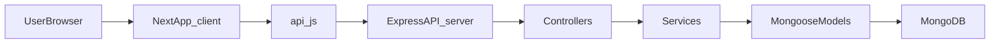
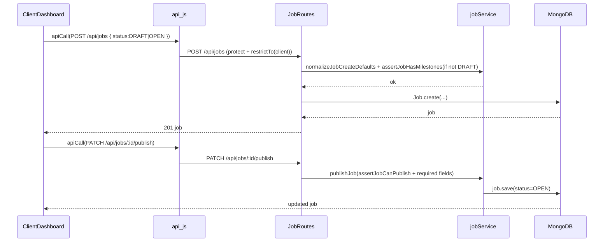
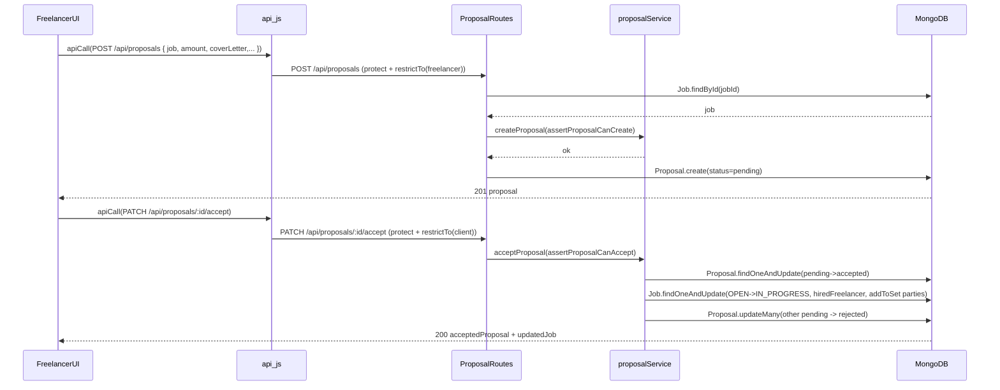
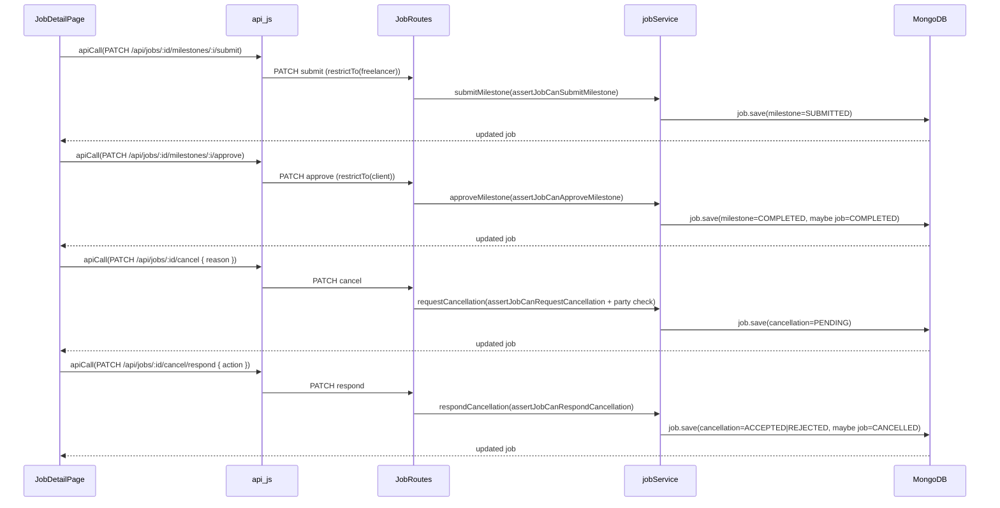
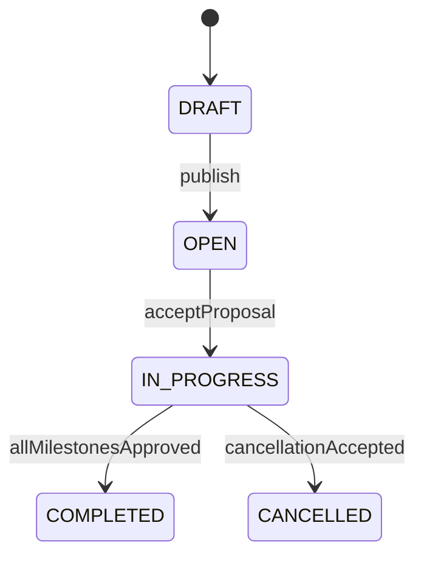
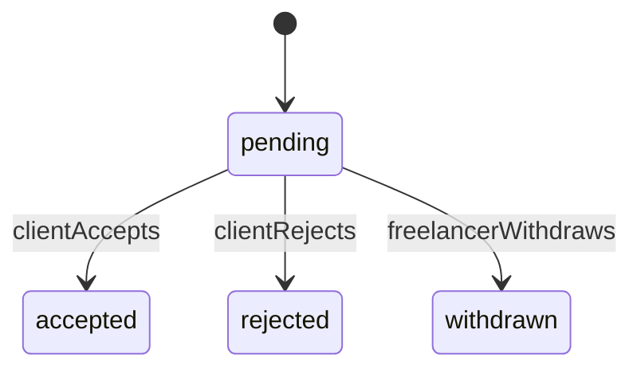
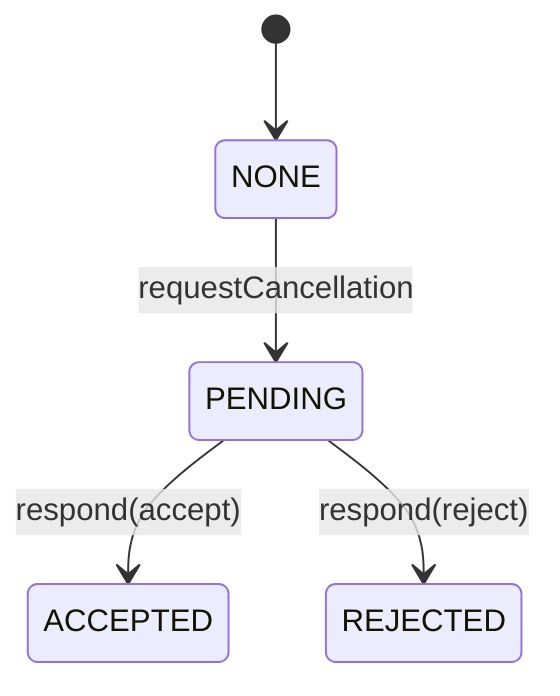
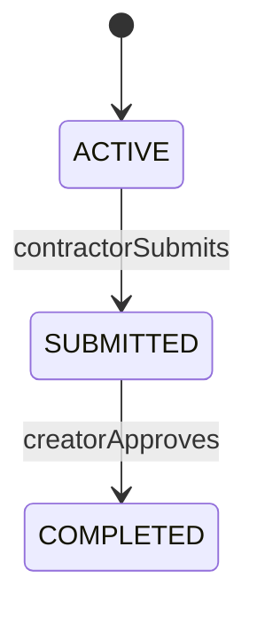
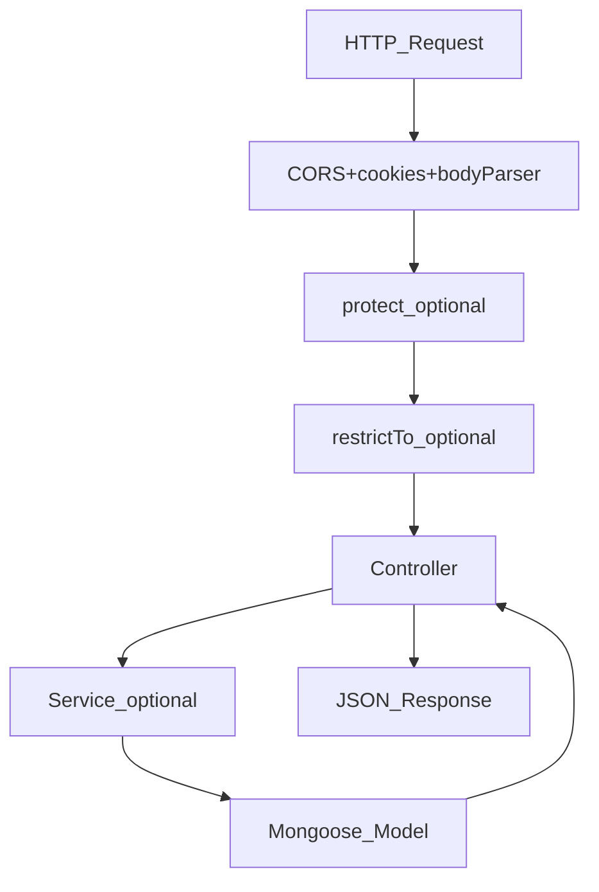

# Neplance — Full-Stack Codebase Documentation

Neplance is a full-stack freelance talent marketplace built for the Nepali market. It connects **clients** (who post jobs) with **freelancers** (who submit proposals), supporting both digital and physical job types. The core domain is **Jobs (contracts)**, **Proposals**, **Milestones**, and **Cancellation**.

This document is written for full-stack engineers: it explains **where things live**, **how requests flow**, and **how to extend the system safely**.

---

## Quickstart (new engineer)

### Run locally (2 terminals)

1. **Backend**

```bash
cd server
npm install
# create server/.env (see Environment Variables below)
npm start
```

1. **Frontend**

```bash
cd client
npm install
# create client/.env.local with:
# NEXT_PUBLIC_API_BASE_URL=http://localhost:5000
npm run dev
```

- Frontend: `http://localhost:3000`
- Backend health: `http://localhost:5000/api/health`

### First flow to trace

- Login UI → token issuance → authenticated API calls:
  - UI: `client/src/app/login/page.jsx`
  - API helper: `client/src/services/api.js`
  - Token storage: `client/src/shared/utils/auth.js`
  - Backend auth: `server/src/controllers/authController.js`
  - Guard: `server/src/middlewares/authMiddleware.js`

---

## Table of contents

- [Architecture overview](#architecture-overview)
- [Tech stack](#tech-stack)
- [Project structure](#project-structure)
- [Data models](#data-models)
- [Authentication--authorization](#authentication--authorization)
- [API routes](#api-routes)
- [End-to-end flows](#end-to-end-flows)
- [State-machine--business-rules](#state-machine--business-rules)
- [Frontend architecture](#frontend-architecture)
- [Error handling](#error-handling)
- [Environment variables](#environment-variables)
- [Getting started](#getting-started)
- [How to extend the system](#how-to-extend-the-system)
- [Key design decisions](#key-design-decisions)

---

## Architecture overview

### High-level request path (browser → DB)




### Deployment routing (Vercel)

- `vercel.json` routes:
  - `/api/*` is handled by `server/server.js`
  - everything else is served by Next.js in `client/`

## Tech Stack

### Frontend (`/client`)

- **Framework**: Next.js 16 (App Router) + React 19
- **Styling**: TailwindCSS 4 via PostCSS, CSS custom properties (variables)
- **Validation**: Zod 4
- **Linting/Formatting**: Biome 2.2
- **Compiler**: `babel-plugin-react-compiler` (React Compiler)
- **Font**: Geist (Google Fonts)

### Backend (`/server`)

- **Runtime**: Node.js + Express 4
- **Database**: MongoDB via Mongoose 8
- **Auth**: JWT (access + refresh tokens), bcryptjs for hashing, HTTP-only cookies for refresh tokens
- **Validation**: express-validator, validator.js
- **Security**: express-rate-limit, CORS, cookie-parser
- **Dev tooling**: Nodemon, Morgan (HTTP logging), dotenv

### Deployment

- **Platform**: Vercel (configured via `vercel.json`)
- Frontend served via `@vercel/next`, backend via `@vercel/node`
- API routes proxied: `/api/`* → `server/server.js`, everything else → `client/`

---

## Project Structure

```
Neplance/
├── client/                        # Next.js frontend
│   ├── src/
│   │   ├── app/                   # App Router pages
│   │   │   ├── layout.jsx         # Root layout (AuthProvider, Geist font)
│   │   │   ├── page.jsx           # Landing page (hero, CTA sections)
│   │   │   ├── login/page.jsx
│   │   │   ├── signup/page.jsx
│   │   │   ├── dashboard/page.jsx # Role-based dashboard (client/freelancer)
│   │   │   ├── jobs/page.jsx      # Job listing (freelancers)
│   │   │   ├── jobs/[id]/page.jsx # Job detail
│   │   │   ├── jobs/[id]/edit/page.jsx
│   │   │   ├── proposals/[id]/page.jsx
│   │   │   ├── profile/page.jsx
│   │   │   ├── profile/edit/page.jsx
│   │   │   ├── freelancers/[id]/page.jsx
│   │   │   ├── talent/page.jsx
│   │   │   └── admin/page.jsx
│   │   ├── features/
│   │   │   ├── auth/components/   # AuthPanel, AuthTabs, LoginForm, SignupForm
│   │   │   └── dashboard/
│   │   │       ├── components/    # EmptyState, JobCard, JobModal
│   │   │       ├── hooks/         # useClientDashboard, useFreelancerDashboard, useProfileData
│   │   │       └── screens/       # ClientDashboard, FreelancerDashboard
│   │   ├── services/
│   │   │   └── api.js             # API client (apiCall, apiAuthCall, token refresh)
│   │   ├── shared/
│   │   │   ├── brand/             # HeroSection (landing page sections)
│   │   │   ├── constants/         # jobCategories, statuses
│   │   │   ├── context/           # AuthContext (user state, role switching)
│   │   │   ├── hooks/             # useAuthGate (auth redirect logic)
│   │   │   ├── lib/               # validation.js (Zod schemas for all forms)
│   │   │   ├── navigation/        # Navbar
│   │   │   ├── ui/                # UI.jsx (reusable Input, etc.)
│   │   │   └── utils/             # auth.js (token storage), job.js
│   │   └── styles/                # CSS files (base, layout, components, dashboard, navigation, variables)
│   ├── biome.json
│   ├── next.config.mjs
│   ├── postcss.config.mjs
│   └── package.json
│
├── server/                        # Express backend
│   ├── server.js                  # Entry point (Express app, CORS, routes, DB connect)
│   ├── src/
│   │   ├── config/
│   │   │   └── db.js              # MongoDB connection (cached singleton)
│   │   ├── constants/
│   │   │   └── statuses.js        # JOB_STATUS, PROPOSAL_STATUS, CANCELLATION_STATUS, MILESTONE_STATUS
│   │   ├── controllers/
│   │   │   ├── authController.js  # register, login, logout, refreshAccessToken, getUser
│   │   │   ├── jobController.js   # CRUD, publish, milestones, cancellation
│   │   │   ├── proposalController.js  # create, accept, reject, withdraw, get
│   │   │   ├── userController.js  # profile CRUD, deactivation, freelancer listing
│   │   │   └── errorController.js # Global error handler (duplicate key, validation, cast errors)
│   │   ├── middlewares/
│   │   │   ├── authMiddleware.js   # protect (JWT verification), restrictTo (role guard)
│   │   │   └── rateLimiter.js      # authLimiter, loginLimiter, refreshLimiter
│   │   ├── models/
│   │   │   ├── User.js            # User schema (roles, profile, password hashing, soft-delete)
│   │   │   ├── Job.js             # Job schema (milestones, parties, location, budget, cancellation)
│   │   │   └── Proposal.js        # Proposal schema (freelancer ↔ job link, status, cover letter)
│   │   ├── routes/
│   │   │   ├── authRoute.js       # /api/auth/*
│   │   │   ├── jobRoutes.js       # /api/jobs/*
│   │   │   ├── proposalRoutes.js  # /api/proposals/*
│   │   │   ├── userRoutes.js      # /api/users/*
│   │   │   └── indexRoute.js      # /api (welcome message)
│   │   ├── services/
│   │   │   ├── jobService.js      # Job business logic (publish, delete, milestone, cancellation)
│   │   │   ├── proposalService.js # Proposal business logic (accept with atomic updates, reject, withdraw)
│   │   │   └── statusTransitions.js # State machine assertions for jobs and proposals
│   │   └── utils/
│   │       ├── appError.js        # Custom operational error class
│   │       ├── catchAsync.js      # Async route handler wrapper
│   │       ├── jobAccess.js       # Authorization helpers (ensureCreator, ensureContractor, isPartyUser)
│   │       ├── userFields.js      # Field whitelist per role (pickUserFields)
│   │       └── logger.js          # Timestamp-based console logger
│   └── package.json
│
├── vercel.json                    # Vercel deployment config
└── README.md
```

---

## Data Models

### User

- **Roles**: `admin`, `client`, `freelancer` (stored as array — users can have multiple roles)
- **Profile fields**: name, email, phone, avatar, bio, location (address/city/district/province/coordinates)
- **Freelancer-specific**: skills[], hourlyRate, experienceLevel (entry/intermediate/expert), jobTypePreference (digital/physical/both), availabilityStatus, languages[], portfolio[]
- **Auth**: password (bcrypt hashed, cost 12), passwordConfirm (virtual, validated on save)
- **Soft-delete**: `active` field (false = deactivated); `pre(/^find/)` hook auto-filters inactive users

### Job

- **Core**: title, description, jobType (digital/physical), category, subcategory, tags[], requiredSkills[]
- **Budget**: budgetType (fixed/hourly), budget { min, max, currency (default "NPR") }
- **Location**: address, city, district, province, coordinates, isRemote
- **Status lifecycle**: `DRAFT` → `OPEN` → `IN_PROGRESS` → `COMPLETED` or `CANCELLED`
- **Milestones**: Array of { title, description, value, dueDate, status (ACTIVE/SUBMITTED/COMPLETED/CANCELLED), evidence, approvedBy[] }
- **Parties**: Array of { address (userId), role (CREATOR/CONTRACTOR/ARBITRATOR), publicKey, signature }
- **Cancellation**: `{ status (NONE/PENDING/ACCEPTED/REJECTED), initiatedBy, reason, requestedAt, respondedBy, respondedAt }`
- **Relationships**: `creatorAddress` → User, `hiredFreelancer` → User
- **Indexes**: category+status, jobType+status, location.city+district, tags, createdAt, deadline

### Proposal

- **Fields**: freelancer → User, job → Job, status, amount, coverLetter, deliveryDays, revisionsIncluded, attachments[] (URL-validated), isRead, withdrawnAt, rejectedAt, rejectionReason
- **Status lifecycle**: `pending` → `accepted` / `rejected` / `withdrawn`
- **Unique index**: Partial unique on (freelancer, job) where status is pending or accepted — prevents duplicate active proposals

---

## Authentication & Authorization

### Auth Flow

1. **Register** (`POST /api/auth/register`): Creates user, returns access token (JSON) + refresh token (HTTP-only cookie, 7d expiry)
2. **Login** (`POST /api/auth/login`): Validates credentials, issues tokens
3. **Refresh** (`GET /api/auth/refresh`): Reads refresh token from cookie, issues new access token
4. **Logout** (`GET /api/auth/logout`): Clears refresh cookie, sets no-cache headers
5. **Get current user** (`GET /api/auth/me`): Protected route, returns user profile

### Token Strategy

- **Access token**: Short-lived (15m default), sent via `Authorization: Bearer <token>`, stored in `localStorage`
- **Refresh token**: Long-lived (7d), HTTP-only cookie, `sameSite: lax`, `secure` in production
- Client-side `api.js` implements transparent token refresh with a subscriber queue to handle concurrent 401s

### Middleware

- `protect`: Verifies JWT, attaches `req.user`, returns `TOKEN_EXPIRED` error code for expired access tokens
- `restrictTo(...roles)`: Checks if user's role array includes any allowed role

### Rate Limiting

- Login: 50 req/15min
- Auth (register/logout): 100 req/15min
- Refresh: 150 req/15min

---

## API Routes

### Auth — `/api/auth`


| Method | Endpoint    | Auth   | Description               |
| ------ | ----------- | ------ | ------------------------- |
| POST   | `/login`    | No     | Login with email/password |
| POST   | `/register` | No     | Register new user         |
| GET    | `/logout`   | No     | Clear session             |
| GET    | `/refresh`  | Cookie | Refresh access token      |
| GET    | `/me`       | Yes    | Get current user          |


### Jobs — `/api/jobs` (all protected)


| Method | Endpoint                         | Role          | Description                                                |
| ------ | -------------------------------- | ------------- | ---------------------------------------------------------- |
| GET    | `/`                              | freelancer    | List open public jobs (with filtering, search, pagination) |
| POST   | `/`                              | client        | Create job (DRAFT or OPEN)                                 |
| GET    | `/myJobs`                        | client        | List own jobs                                              |
| GET    | `/categories`                    | any           | Get distinct job categories                                |
| GET    | `/:id`                           | any           | Get job detail (visibility check)                          |
| PATCH  | `/:id`                           | client        | Update own draft/open job                                  |
| DELETE | `/:id`                           | client        | Delete own draft/open job                                  |
| PATCH  | `/:id/publish`                   | client        | Publish draft → open                                       |
| PATCH  | `/:id/milestones/:index/submit`  | freelancer    | Submit milestone evidence                                  |
| PATCH  | `/:id/milestones/:index/approve` | client        | Approve submitted milestone                                |
| PATCH  | `/:id/cancel`                    | any party     | Request cancellation                                       |
| PATCH  | `/:id/cancel/respond`            | counter-party | Accept/reject cancellation                                 |


### Proposals — `/api/proposals` (all protected)


| Method | Endpoint        | Role             | Description                                                         |
| ------ | --------------- | ---------------- | ------------------------------------------------------------------- |
| POST   | `/`             | freelancer       | Submit proposal for a job                                           |
| GET    | `/myProposals`  | freelancer       | List own proposals                                                  |
| GET    | `/job/:jobId`   | client           | Get proposals for own job                                           |
| GET    | `/:id`          | owner/freelancer | Get proposal detail                                                 |
| PATCH  | `/:id/accept`   | client           | Accept proposal (hires freelancer, rejects other pending proposals) |
| PATCH  | `/:id/reject`   | client           | Reject proposal                                                     |
| PATCH  | `/:id/withdraw` | freelancer       | Withdraw own pending proposal                                       |


### Users — `/api/users`


| Method | Endpoint                       | Auth | Description                                           |
| ------ | ------------------------------ | ---- | ----------------------------------------------------- |
| GET    | `/freelancers`                 | No   | List freelancers (search, skills filter, pagination)  |
| GET    | `/freelancers/:id`             | No   | Get freelancer profile                                |
| GET    | `/me`                          | Yes  | Get own profile                                       |
| PATCH  | `/me`                          | Yes  | Update own profile (role-scoped fields)               |
| DELETE | `/me`                          | Yes  | Deactivate account (blocked if active jobs/proposals) |
| GET    | `/me/check-delete-eligibility` | Yes  | Check if account can be deactivated                   |


### Other


| Method | Endpoint      | Description                           |
| ------ | ------------- | ------------------------------------- |
| GET    | `/api`        | Welcome message                       |
| GET    | `/api/health` | Health check (includes DB readyState) |


---

## End-to-end Flows

### Flow A — Login + token refresh (access JWT + refresh cookie)

**Frontend building blocks**

- `client/src/shared/context/AuthContext.jsx`: hydrates user via `GET /api/auth/me`
- `client/src/services/api.js`: attaches `Authorization: Bearer <accessToken>` and on `TOKEN_EXPIRED` calls `GET /api/auth/refresh` (cookie) then retries
- `client/src/shared/utils/auth.js`: stores access token in `localStorage` key `neplance.accessToken`

**Backend building blocks**

- `server/src/controllers/authController.js`: issues access token + sets HTTP-only `refreshToken` cookie; refresh returns a new access token
- `server/src/middlewares/authMiddleware.js`: throws 401 with `errorCode: TOKEN_EXPIRED` on expired access tokens (used by the frontend refresh logic)

```mermaid
sequenceDiagram
  participant UI as NextUI
  participant API as api_js
  participant BE as ExpressAPI
  participant DB as MongoDB

  UI->>API: apiAuthCall(/api/auth/login)
  API->>BE: POST /api/auth/login
  BE->>DB: User.findOne + correctPassword
  DB-->>BE: user
  BE-->>API: accessToken + Set-Cookie(refreshToken)
  API->>API: setAccessToken(localStorage)
  API-->>UI: success

  UI->>API: apiCall(/api/auth/me) with Authorization
  API->>BE: GET /api/auth/me
  BE-->>API: 401 { errorCode: TOKEN_EXPIRED } (if expired)
  API->>BE: GET /api/auth/refresh (with credentials: include)
  BE-->>API: 200 { accessToken }
  API->>API: setAccessToken(localStorage)
  API->>BE: retry GET /api/auth/me
  BE-->>API: 200 { data: { user } }
  API-->>UI: user hydrated
```




### Flow B — Client posts a job (draft/open) and publishes

- UI: `client/src/features/dashboard/screens/ClientDashboard.jsx`
  Save draft: `POST /api/jobs` with `status: "DRAFT"` (milestones optional)
- Post job: `POST /api/jobs` with `status: "OPEN"` (milestones required by backend rules)
- Publish draft: `PATCH /api/jobs/:id/publish`
- BE: `server/src/controllers/jobController.js` + `server/src/services/jobService.js`




### Flow C — Freelancer proposes → Client accepts → Job becomes IN_PROGRESS

- UI (freelancer): `client/src/app/jobs/page.jsx` and `client/src/app/jobs/[id]/page.jsx` call `POST /api/proposals`
- UI (client): `client/src/features/dashboard/screens/ClientDashboard.jsx` accepts via `PATCH /api/proposals/:id/accept`
- BE: `server/src/controllers/proposalController.js` + `server/src/services/proposalService.js`




### Flow D — Milestones + cancellation (IN_PROGRESS contracts)

- Milestone submit (contractor): `PATCH /api/jobs/:id/milestones/:index/submit`
- Milestone approve (creator): `PATCH /api/jobs/:id/milestones/:index/approve`
- Cancellation request/respond: `PATCH /api/jobs/:id/cancel` and `PATCH /api/jobs/:id/cancel/respond`

Reference UI: `client/src/app/jobs/[id]/page.jsx` (milestones + cancellation actions)




## Job Filtering (freelancer view)

Supports query parameters:

- `category`, `jobType`, `experienceLevel`, `budgetType`
- `minBudget`, `maxBudget`
- `city`, `district`, `province`, `isRemote`
- `tags` (comma-separated), `skills` (comma-separated)
- `search` (searches title, description, tags via regex)
- `isUrgent`, `isFeatured`
- `sort` (default: `-createdAt`), `page`, `limit` (default: 20)

Each job in the response includes a `proposalCount` (aggregated from the Proposal collection).

---

## State Machine / Business Rules

### Job Status Transitions




- **Publish rules**: draft jobs can be published only if `category` and `budget.min` exist (`server/src/services/jobService.js`).
- **Update/Delete rules**: only `DRAFT` and `OPEN` jobs can be updated/deleted (`server/src/services/statusTransitions.js`).

### Proposal Status Transitions




### Cancellation Flow




- Only `IN_PROGRESS` jobs can be cancelled (`assertJobCanRequestCancellation`).
- The initiator cannot respond to their own cancellation request (`assertJobCanRespondCancellation`).

### Milestone Flow




- Milestones can only be submitted when the job is `IN_PROGRESS` and milestone is `ACTIVE`.
- Approving the last milestone automatically sets the job status to `COMPLETED` (`server/src/services/jobService.js`).

---

## Frontend Architecture

### Routing (Next.js App Router)

- `/` — Landing page (redirects authenticated users to `/dashboard`)
- `/login`, `/signup` — Auth forms
- `/dashboard` — Role-based: shows `ClientDashboard` or `FreelancerDashboard` based on `activeRole`
- `/jobs` — Browse open jobs (freelancer view)
- `/jobs/[id]` — Job detail
- `/jobs/[id]/edit` — Edit job (client)
- `/proposals/[id]` — Proposal detail
- `/profile` — View own profile
- `/profile/edit` — Edit profile
- `/freelancers/[id]` — Public freelancer profile
- `/talent` — Browse freelancers
- `/admin` — Admin panel

### Auth Context (`AuthContext.jsx`)

- Wraps the entire app in `<AuthProvider>`
- On mount: calls `/api/auth/me` to hydrate user state
- Exposes: `user`, `activeRole`, `isHydrated`, `loadingUser`, `refreshUser`, `updateUser`, `switchRole`, `logout`
- Role switching: toggles between `client` and `freelancer` for dual-role users, persisted in `localStorage`

### Auth Gate (`useAuthGate` hook)

- `mode: "require-auth"` — Redirects unauthenticated users to `/`
- `mode: "redirect-authed"` — Redirects authenticated users to `/dashboard`
- Returns: user, currentRole, isFreelancer, isClient, roleList

### API Client (`services/api.js`)

- `apiCall(endpoint, options)` — Authenticated requests with automatic token refresh
  - On 401 with `TOKEN_EXPIRED`: refreshes access token transparently, retries request
  - Queues concurrent requests during refresh
  - On unrecoverable 401: clears token, redirects to `/`
- `apiAuthCall(endpoint, body)` — Unauthenticated POST (login/register)
- Custom `APIError` class with message, status, errorCode

### Client-Side Validation (Zod)

Schemas defined in `shared/lib/validation.js`:

- `loginSchema` — email + password
- `signupSchema` — full registration with password confirmation, optional profile fields, role selection
- `profileUpdateSchema` — all profile fields, portfolio array, coordinate validation
- `proposalSchema` — amount, cover letter, delivery days, revisions, attachments
- `jobCreateSchema` — title, description, budget with min/max validation, milestones array
- `validateForm(schema, data)` — Returns `{ errors, data }` with path-keyed error messages

### Constants (shared client/server)

- Job categories: Web Dev, Mobile Dev, UI/UX, Graphic Design, Content Writing, Digital Marketing, Video Editing, Data Entry, Accounting, Translation, Photography, Tutoring, Plumbing, Electrical, Carpentry, Cleaning, Delivery, Event Planning, Other
- Nepal provinces: Bagmati, Gandaki, Karnali, Koshi, Lumbini, Madhesh, Sudurpashchim
- Experience levels: entry, intermediate, expert
- Status enums mirrored on both client and server

---

## Backend Architecture

### Server entrypoint

- Entry file: `server/server.js`
  - Loads env: `dotenv.config({ path: "./.env" })`
  - CORS:
    - allows `http://localhost:3000` and `FRONTEND_BASE_URL` (or `https://${VERCEL_URL}`) and enables `credentials: true`
  - JSON + URL-encoded parsing + cookies:
    - `express.json()`, `express.urlencoded()`, `cookieParser()`
  - Mounts routers:
    - `/api` → `server/src/routes/indexRoute.js`
    - `/api/auth` → `server/src/routes/authRoute.js`
    - `/api/jobs` → `server/src/routes/jobRoutes.js`
    - `/api/proposals` → `server/src/routes/proposalRoutes.js`
    - `/api/users` → `server/src/routes/userRoutes.js`
  - Health route: `GET /api/health` includes `mongoose.connection.readyState`
  - 404 + error handler:
    - unknown routes call `AppError` (`server/src/utils/appError.js`)
    - global handler is `server/src/controllers/errorController.js`
  - DB connection:
    - `connectDB()` in `server/src/config/db.js` uses a cached singleton pattern (`global.mongoose`) for reuse

### Request lifecycle (typical)




### Auth & role-based access control

- Guard middleware: `server/src/middlewares/authMiddleware.js`
  - `protect`: verifies `Authorization: Bearer <token>` (type must be `"access"`), loads the `User`, attaches `req.user`
  - Expired tokens: throws 401 with `errorCode: "TOKEN_EXPIRED"` (this drives the frontend refresh retry in `client/src/services/api.js`)
  - `restrictTo(...roles)`: checks that `req.user.role` contains at least one allowed role

### Controllers vs services (where business rules live)

- Controllers handle HTTP, input picking, and response shaping:
  - `server/src/controllers/authController.js`
  - `server/src/controllers/jobController.js`
  - `server/src/controllers/proposalController.js`
  - `server/src/controllers/userController.js`
- Services enforce business rules and state transitions:
  - `server/src/services/jobService.js` + `server/src/services/statusTransitions.js`
  - `server/src/services/proposalService.js` + `server/src/services/statusTransitions.js`

### Error handling contract

- Error model: `server/src/utils/appError.js` supports `errorCode` for machine-readable cases
- Error middleware: `server/src/controllers/errorController.js`
  - Normalizes Mongo duplicate keys, cast errors, validation errors
  - Returns `{ status, message, errorCode? }` consistently (frontend wraps this into `APIError`)

## Error Handling

### Backend

- `AppError` class: operational errors with statusCode, status ("fail"/"error"), optional errorCode
- `catchAsync` wrapper: catches async errors and passes to Express error handler
- Global error controller handles:
  - MongoDB duplicate key (11000) → friendly message, special handling for duplicate proposals
  - Mongoose `ValidationError` → joined field messages
  - Mongoose `CastError` → "Invalid {path}: {value}"
- Structured JSON responses: `{ status, message, errorCode? }`

### Frontend

- `APIError` class mirrors backend structure
- Network errors caught and wrapped
- 401s trigger automatic session recovery or redirect

---

## Environment Variables

### Server (`.env`)

- `NEPLANCE_MONGODB_URI` — MongoDB connection string
- `SERVER_PORT` — Express port (default: 5000)
- `FRONTEND_BASE_URL` — Allowed CORS origin
- `AUTH_JWT_SECRET` — JWT signing secret
- `AUTH_ACCESS_TOKEN_EXPIRY` — Access token TTL (default: "15m")
- `AUTH_REFRESH_TOKEN_EXPIRY` — Refresh token TTL (default: "7d")
- `NODE_ENV` — "production" enables secure cookies
- `VERCEL_URL` — Auto-set by Vercel for frontend URL fallback

### Client (`.env.local`)

- `NEXT_PUBLIC_API_BASE_URL` — Backend API base URL (e.g., `http://localhost:5000`)

### Environment notes (common gotchas)

- **CORS + cookies**: the backend enables `credentials: true` and expects the frontend origin to be allowed (`server/server.js`). If your frontend URL changes, update `FRONTEND_BASE_URL`.
- **Refresh token cookie**: refresh tokens are set as an HTTP-only cookie named `refreshToken` (`server/src/controllers/authController.js`). In production (`NODE_ENV=production`), cookies are marked `secure`.
- **Frontend fetch config**: `client/src/services/api.js` always uses `credentials: "include"` so the refresh cookie is sent with requests to the API host.

---

## Getting Started

### Prerequisites

- Node.js (v18+)
- MongoDB instance (local or Atlas)

### Backend

```bash
cd server
npm install
# Create server/.env (or copy from .env.example if present) and configure:
#   NEPLANCE_MONGODB_URI, SERVER_PORT, FRONTEND_BASE_URL, AUTH_JWT_SECRET
npm start    # Runs with nodemon
```

### Frontend

```bash
cd client
npm install
# Create client/.env.local (or copy from .env.example if present) and set:
#   NEXT_PUBLIC_API_BASE_URL=http://localhost:5000
npm run dev  # Starts on http://localhost:3000
```

### Available Scripts

**Client**: `dev`, `build`, `start`, `lint` (biome check), `format` (biome format)
**Server**: `start` (nodemon server.js)

---

## How to Extend the System

### Add a new API endpoint (backend)

Neplance uses a consistent **route → controller → service → model** layering.

- **Step 1 — Add route**
  - Add a route in one of:
    - `server/src/routes/jobRoutes.js`
    - `server/src/routes/proposalRoutes.js`
    - `server/src/routes/userRoutes.js`
    - `server/src/routes/authRoute.js`
- **Step 2 — Add controller handler**
  - Implement the request handler in the matching controller file under `server/src/controllers/`.
  - Wrap async handlers with `catchAsync` (see `server/src/utils/catchAsync.js`).
- **Step 3 — Put rules in services when it’s “business logic”**
  - If the handler has state machine rules, status transitions, or multi-document updates, implement it in:
    - `server/src/services/jobService.js`
    - `server/src/services/proposalService.js`
    - and enforce constraints via `server/src/services/statusTransitions.js`
- **Step 4 — Protect it**
  - Add `protect` + `restrictTo(...)` as needed in the route file:
    - `server/src/middlewares/authMiddleware.js`
- **Step 5 — Wire frontend**
  - Call from UI via `apiCall()` (authenticated) or `apiAuthCall()` (login/register) in `client/src/services/api.js`.

### Add a new page (frontend)

- Create a route under `client/src/app/<route>/page.jsx` (Next.js App Router).
- For auth requirements, use `useAuthGate`:
  - `mode: "require-auth"` for protected pages
  - `mode: "redirect-authed"` for login/signup
- Use `apiCall()` for server communication and handle loading/error state locally.

### Add/modify statuses (jobs/proposals/milestones/cancellation)

Statuses are part of the system’s “contract” and must be updated in multiple places.

- Backend source of truth: `server/src/constants/statuses.js`
- Backend enforcement: `server/src/services/statusTransitions.js`
- Frontend mirror: `client/src/shared/constants/statuses.js`
- UI rendering helpers: `client/src/shared/utils/job.js` and dashboards/pages that display status badges.

When adding a status:

- Update backend constants + transitions first.
- Update the frontend constants next.
- Finally update UI conditionals (e.g., which buttons show up for which status).

## Key Design Decisions

1. **Multi-role users**: Users can be both client and freelancer simultaneously. The frontend tracks `activeRole` and lets users switch roles from the navbar.
2. **Milestone-based contracts**: Jobs require milestones before publishing. Each milestone has an independent status lifecycle, and the job auto-completes when all milestones are approved.
3. **Mutual cancellation**: Neither party can unilaterally cancel an in-progress contract. The counter-party must accept or reject the cancellation request.
4. **Atomic proposal acceptance**: Uses `findOneAndUpdate` with status preconditions to prevent race conditions when accepting proposals. Auto-rejects other pending proposals for the same job.
5. **Token refresh queue**: Concurrent 401s during token refresh are queued and resolved together, preventing redundant refresh calls.
6. **Soft-delete for users**: Accounts are deactivated (not deleted) with pre-find hooks filtering them out. Deactivation is blocked if the user has active jobs/proposals.
7. **Nepal-specific**: Default currency is NPR, provinces are Nepali provinces, categories include physical services (plumbing, electrical, carpentry).
8. **Role-scoped field updates**: The `pickUserFields` utility ensures freelancer-only fields (skills, hourlyRate, portfolio, etc.) can only be updated by freelancer-role users.

